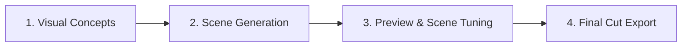

# ⏱️✨ Magic Countdown Generator

> **Turn any brand, theme, or keynote idea into a broadcast-ready, synchronized 30-second countdown video and 2-minute event opener in minutes.**

[](https://cloud.google.com/run)
[](https://react.dev/)
[](https://www.typescriptlang.org/)
[](https://vitejs.dev/)
[](https://tailwindcss.com/)
[](https://ffmpeg.org/)
[](LICENSE)

---

## 🌟 Overview

The **Magic Countdown Generator** is an automated, AI-assisted video production studio tailored for conferences, keynotes, webinars, and live product launches. 

Instead of generic digital clock counters or hours in manual video editing software, the app generates **diegetic countdown scenes** (numbers 10 down to 1 naturally integrated into physical objects, architecture, nature, or product interfaces) matched to any customer brand or creative theme. Every scene is mathematically aligned to high-energy countdown music with a dramatic silence drop pause, culminating in broadcast-ready downloads.

---

## 🎬 Key Capabilities

### 1. 🎯 Diegetic Storytelling (Numbers 10 to 1)
- Numbers aren't just text overlays—they appear organically in the scene: neon signs, steam gauges, etched circuit traces, architecture, or natural elements.
- Visual continuity and theme coherence across all 10 scenes, customized with company branding and color palettes.

### 2. 🎵 Synchronized Beat Grid & Dramatic Drop Pause
Every video is structured according to an exact **30.00-second timing formula**:
- **Act 1 (Numbers 10, 9, 8, 7)**: Fast-paced opening, **2.30s** per scene (*Total: 9.20s*).
- **The Dramatic Pause**: **1.00-second drop to complete black and silence** (*9.20s → 10.20s*), creating anticipation before the beat drops.
- **Act 2 (Numbers 6, 5, 4, 3, 2, 1)**: High-energy climax, **3.30s** per scene (*Total: 19.80s*).
- Seamless audio-video synchronization verified frame-by-frame.

### 3. ⚡ Parallel Scene Synthesis & Queue Awareness
- Generates 2 scenes concurrently with dynamic ETA calculation.
- Queue-aware system alerts team members when multiple projects are running in parallel.
- Audio chimes, browser title pulsing, and native desktop notifications alert creators when rendering completes.

### 4. 🎛️ Interactive Waveform Timeline & Scene Fine-Tuning
- **Waveform Timeline**: Interactive, millisecond-accurate audio scrubbing and synchronized frame preview.
- **Fine-Tuning Workspace**: Re-prompt, tweak visual descriptions, or generate new creative takes for individual scenes without re-rendering unaffected scenes.
- **Scene Quality Inspector**: Automated visual inspection and readability validation.

### 5. 📦 Broadcast-Ready Exports (2 Formats, 2 Qualities)
- **30-Second Final Cut (Stand-alone)**: High-energy 30-second sequence with integrated countdown music and dramatic drop pause.
- **2-Minute Extended Full Video**: Seamlessly combines the inspirational 90-second Event Opening Video with the 30-second countdown via a smooth 2-second crossfade transition.
- **Resolutions**: Fast 720p Turbo for rapid team review and Studio 4K Ultra HD for live projection and stage playback.

### 6. 👥 Team Project Library & Cloud Persistence
- All generated scenes, final cuts, and project states are saved in Google Cloud Storage.
- Team Gallery Carousel displays the last 10 completed videos with one-click preview and project reload.

---

## 🧭 Studio Workflow



1. **Visual Concepts**: Enter customer brand, website, or custom creative theme. The creative assistant drafts 10 diegetic scene concepts.
2. **Scene Generation**: Parallel workers synthesize 10 high-fidelity video scenes with live progress indicators.
3. **Preview & Scene Tuning**: Scrub the synchronized timeline against the audio waveform. Tweak individual scene descriptions and generate new takes as needed.
4. **Final Cut Export**: Choose between the 30s Final Cut or 2-minute Full Video, select resolution (720p or 4K), and export your broadcast MP4.

---

## 🛠️ Tech Stack

| Layer | Technology |
|---|---|
| **Frontend** | React 19, TypeScript, Vite, Tailwind CSS, Lucide React, Wavesurfer.js |
| **Backend** | Node.js, Express, TypeScript (`tsx`), Multer |
| **Video Engine** | FFmpeg (concat filter graphs, audio ducking, crossfades, Lanczos 4K scaling) |
| **Generative Models** | Google Gemini (Ideation & Prompts) & Veo Video Models via Vertex AI / Google Gen AI SDK |
| **Storage & Hosting** | Google Cloud Storage (GCS), Google Cloud Run (Serverless Container) |

---

## 🚀 Getting Started

### Prerequisites
- **Node.js**: `v20+`
- **FFmpeg**: Required locally for audio-video assembly (`brew install ffmpeg` on macOS)
- **Google Cloud Project**: With Vertex AI API and Cloud Storage bucket enabled (or Gemini API key)

### Local Installation

1. **Clone the repository**:
   ```bash
   git clone https://github.com/aosterloh/magic-countdown-generator.git
   cd magic-countdown-generator
   ```

2. **Install dependencies**:
   ```bash
   npm install
   ```

3. **Configure Environment Variables**:
   Create a `.env` file in the root directory:
   ```env
   PORT=3001
   GEMINI_API_KEY=your_gemini_api_key
   GCS_BUCKET_NAME=your_storage_bucket_name
   APP_PASSWORD=your_access_password
   ```

4. **Start the Development Servers**:
   In one terminal (backend API server):
   ```bash
   npm run server
   ```
   In a second terminal (Vite frontend dev server):
   ```bash
   npm run dev
   ```
   Open your browser to `http://localhost:5173`.

---

## 📦 Production Build & Deployment

### Build Locally
```bash
npm run build
```

### Run with Docker
```bash
docker build -t magic-countdown-generator .
docker run -p 8080:8080 --env-file .env magic-countdown-generator
```

### Deploy to Google Cloud Run
```bash
gcloud run deploy magic-countdown-generator \
  --source . \
  --region us-central1 \
  --project your-gcp-project-id \
  --allow-unauthenticated \
  --memory=8Gi \
  --cpu=4
```

---

## 📁 Project Structure

```
├── Dockerfile                  # Production multi-stage Docker build with FFmpeg
├── public/                     # Static assets (audio tracks, event opener, sample media)
├── server/                     # Express backend API
│   ├── gcsStorage.ts           # Google Cloud Storage integration & persistence
│   ├── gemini.ts               # Gemini visual concept & prompt generation
│   ├── index.ts                # Main Express routes, FFmpeg export endpoints & proxying
│   └── veo.ts                  # Veo video synthesis client
├── src/                        # React 19 Frontend
│   ├── components/             # UI components
│   │   ├── BulkVideoProgressPanel.tsx # Parallel scene generation & queue banner
│   │   ├── Header.tsx                 # Studio header & project selector
│   │   ├── MasterExportModal.tsx      # Final Cut & Full Video export hub
│   │   ├── RecentMastersCarousel.tsx  # Gallery of recent team final cuts
│   │   ├── SimplifiedAudioPreview.tsx # 30-second golden beat playback preview
│   │   ├── SingleClipFixer.tsx        # Fine-tuning & scene take generator
│   │   ├── WaveformTimeline.tsx       # Interactive audio waveform scrubber
│   │   └── ...
│   ├── types/                  # TypeScript interfaces and schemas
│   └── utils/                  # FFmpeg command builders, notifications, media helpers
└── specifications/             # Design specs & EGM documentation
```

---

## 📄 Inclusive Language & Design Standards

This project adheres strictly to modern inclusive language guidelines, using terms like **Final Cut** and **Full Video** throughout user interfaces, export pipelines, and file conventions.

---

## 🤝 Contributing

Contributions, feedback, and feature requests are welcome! Feel free to open an issue or pull request.

---

## 📜 License

This project is licensed under the [MIT License](LICENSE).
